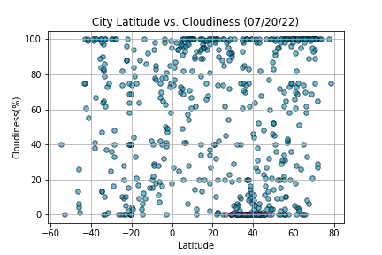
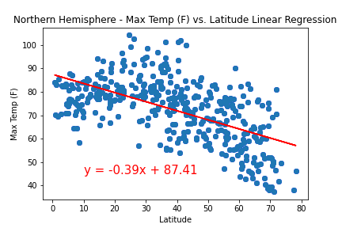
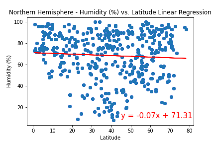
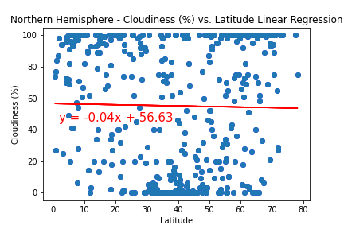
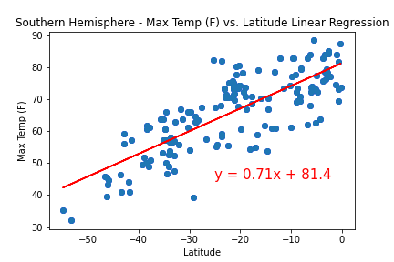
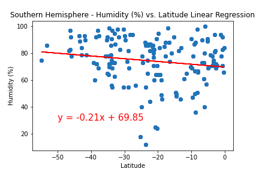
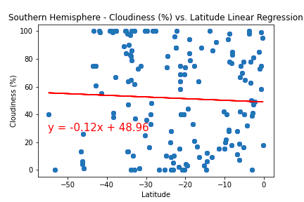
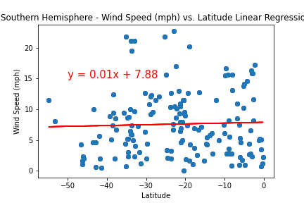
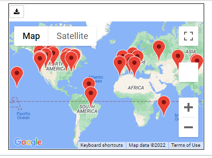

# Python-API-Challenge

This activity consisted of two parts with OpenWeather API, Google Maps API, and a basic Python library - CityPy. The main goals were to find relationships between latitude and different weather variables, as well as finding an ideal place to vacation with the best weather and a hotel to stay at. All output files and figures can be found in each parts' corresponding "Resources" folder.

## Part 1: WeatherPy

For the first part, I was asked to create a script to analyze and visualize the weather of over 500 cities of varying distance from the equator using [CityPy Python Library](https://pypi.python.org/pypi/citipy) and [OpenWeatherMap API](https://openweathermap.org/api). First, I was asked to showcase the following relationships for the whole set, and then the whole set split up by hemisphere (Northern/Southern):

* Temperature (F) vs. Latitude
* Humidity (%) vs. Latitude
* Cloudiness (%) vs. Latitude
* Wind Speed (mph) vs. Latitude

Before delving into the results and visualizations of my analysis of the cities found, there was an important limitation regarding the dataset to address. The PyCity library used does not have much documentation regarding it, so I am unable to find much information on it. However, based off the number of cities retrieved, it's not inclusive of all the cities in the world. Tthe number of cities I was able to successfully retrieve weather data for only make up about 5% of all cities in the world, so we cannot assume that conclusions found based off the results in this dataset would be applicable to locations outside of it. 

**City Maximum Temperature (F) versus Latitude**

When comparing latitude and the maximum temperature of all cities, it seems that the temperature gets higher as it gets closer to 0 latitude, which is where the equator is. Conversely, it seems that the temperature gets lower the further away from 0 latitude it is.

**City Humidity (%) versus Latitude**

Comparing all city's humidity and their corresponding latitude, or location, it seems that there is not much correlation between the two variables. However, at a first glance, it seems that most values tend to be over 20% humidity.

**City Cloudiness (%) versus Latitude**

When comparing all city's cloudiness and latitude, there doesn't seem to be any kind of correlation between the two variables. Even when trying to take a deeper analysis, all the datapoints seem to be scattered all over the plot in no particular order.

**City Wind Speed (mph) versus Latitude**

Lastly, when comparing all city's wind speed (mph) and their latitude, there doesn't appear to be any type of defined relationship between them. However, most values tend to stay below 20 mph overall, with only a few being slightly above that number.

### Northern Hemisphere (above the equator)

**City Maximum Temperature (F) versus Latitude**

When comparing the maximum temperature and latitude of cities in the Northern Hemisphere, I found that the r-value is -0.5865218200510459, indicating a negative relationship between the temperature and latitude of cities in the Northern Hemisphere of my dataset. The number is also closer to -1 than 0, which indicates a strong negative relationship. In other words, in the Northern Hemisphere, as cities get further away from 0, the temperature tends to decrease.

**City Humidity (%) versus Latitude**

When comparing the humidity and latitude of cities in the Northern Hemisphere, I found that the r-value is -0.06173701900871344, indicating a negative relationship between the humidity and latitude of cities in the Northern Hemisphere of my dataset. The number is also closer to 0 than -1, which indicates a very weak, almost negligible relationship. In other words, in the Northern Hemisphere, there is no relationship between humidity and latitude of cities.

**City Cloudiness (%) versus Latitude**

When comparing the cloudiness and latitude of cities in the Northern Hemisphere, I found that the r-value is -0.018616036178394826, indicating a negative relationship between the cloudiness and latitude of cities in the Northern Hemisphere of my dataset. The number is also closer to 0 than -1, which indicates a very weak, almost negligible relationship. In other words, in the Northern Hemisphere, there is no relationship between cloudiness and latitude of cities.

**City Wind Speed (mph) versus Latitude**

When comparing the wind speed and latitude of cities in the Northern Hemisphere, I found that the r-value is -0.024374050986480128, indicating a negative relationship between the wind speed and latitude of cities in the Northern Hemisphere of my dataset. The number is also closer to 0 than -1, which indicates a very weak, almost negligible relationship. In other words, in the Northern Hemisphere, there is no relationship between wind speed and latitude of cities, though most values seem to be under 25 mph except for a couple of outliers.

### Southern Hemisphere (below the equator)

**City Maximum Temperature (F) versus Latitude**

When comparing the maximum temperature and latitude of cities in the Southern Hemisphere, I found that the r-value is 0.7937191209351254, indicating a positive relationship between the temperature and latitude of cities in the Northern Hemisphere of my dataset. The number is also closer to 1 than 0, which indicates a strong, positive relationship between the two variables. In other words, in the Southern Hemisphere, as the latitude of cities increases, so does its temperature.

**City Humidity (%) versus Latitude**

When comparing the humidity and latitude of cities in the Southern Hemisphere, I found that the r-value is -0.15896467520717725, indicating a negative relationship between the humidity and latitude of cities in the Southern Hemisphere of my dataset. The number is also closer to 0 than -1, which indicates a very weak, almost negligible relationship. In other words, in the Southern Hemisphere, there is no relationship between humidity and latitude of cities, though most values appear to be over 35% humidity except for a few outliers.

**City Cloudiness (%) versus Latitude**

When comparing the cloudiness and latitude of cities in the Southern Hemisphere, I found that the r-value is -0.045553698463462695, indicating a negative relationship between the cloudiness and latitude of cities in the Southern Hemisphere of my dataset. The number is also closer to 0 than -1, which indicates a very weak, almost negligible relationship. In other words, in the Southern Hemisphere, there is no relationship between cloudiness and latitude of cities.

**City Wind Speed (mph) versus Latitude**

When comparing the wind speed and latitude of cities in the Southern Hemisphere, I found that the r-value is 0.034240856480209796, indicating a positive relationship between the wind speed and latitude of cities in the Southern Hemisphere of my dataset. The number is also closer to 0 than 1, which indicates a very weak, almost negligible relationship. In other words, in the Southern Hemisphere, there is no relationship between wind speed and latitude of cities, but all values in this chart appear to be under 25 mph.

*See [WeatherPy]("WeatherPy/WeatherPy.ipynb") code

## Part 2: VacationPy

In the second part, I was asked to analyze the dataset of cities and weather from Part 1 using Google Maps to figure out the best place to vacation. First, I was asked to generate a heatmap with Google Maps based off the humidity off each city from the output dataset of Part 1. 

Then, I was asked to find the city with the most ideal weather conditions for vacation. In order to do this, I had to use the cities and weather found in Part 1, and then filter those cities down to the ones with ideal weather conditions. In this case, this meant that the city's weather should be: maximum temperature lower than 80 degrees but higher than 70, with a wind speed less than 10 mph, and zero cloudiness. I did this by filtering the data with loc and performing multiple operations, and then I dropped any other cities that didn't satisfy all desired weather conditions for vacation. Next, I was asked to find a hotel within 5000 meters for each city with ideal weather conditions for vacation, and then add a marker on the map with its name and information. 

The second part of the homework was really fun to do, and out of the 500+ cities that were analyzed, less than 30 had ideal weather conditions for vacationing. Still, this includes plenty of choices of places to go and explore with some of the best weather around the world. I could see a use of this in future opportunities such as generating my own application or database that needs to regularly search for different kinds of information.

*See [VacationPy]("VacationPy/VacationPy.ipynb") code 
