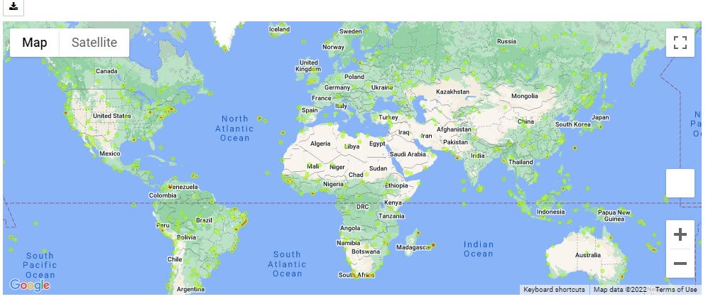

# Python-API-Challenge

## Part 1: WeatherPy

For the first part, I was asked to create a script to analyze and visualize the weather of over 500 cities of varying distance from the equator using [CityPy Python Library](https://pypi.python.org/pypi/citipy) and [OpenWeatherMap API](https://openweathermap.org/api). First, I was asked to showcase the following relationships for the whole set, and then the whole set split up by hemisphere (Northern/Southern):

* Temperature (F) vs. Latitude
* Humidity (%) vs. Latitude
* Cloudiness (%) vs. Latitude
* Wind Speed (mph) vs. Latitude

Before delving into the results and visualizations of my analysis of the cities found, there were a few important limitations regarding the dataset to address. Mainly, the PyCity library used does not have much documentation regarding it, so I am unable to find much information on it. However, based off the number of cities retrieved, it's likely not inclusive of all the existing cities in the world. Based off the number of cities I was able to successfully retrieve weather data for, these only make up about 5% of all cities in the world, so we cannot assume that conclusions found based off the results in this dataset would be applicable to locations outside of it. 

**City Temperature (F) versus Latitude**

**City Humidity (%) versus Latitude**

**City Cloudiness (%) versus Latitude**

**City Wind Speed (mph) versus Latitude**

*See [WeatherPy]("WeatherPy/WeatherPy.ipynb") code

## Part 2: VacationPy

In the second part, I was asked to analyze the dataset of cities and weather from Part 1 using Google Maps to figure out the best place to vacation. First, I was asked to generate a heatmap with Google Maps based off the humidity off each city from the output dataset of Part 1. 

Then, I was asked to find the city with the most ideal weather conditions for vacation. In order to do this, I had to use the cities and weather found in Part 1, and then filter those cities down to the ones with ideal weather conditions. In this case, this meant that the city's weather should be: maximum temperature lower than 80 degrees but higher than 70, with a wind speed less than 10 mph, and zero cloudiness. I did this by filtering the data with loc and performing multiple operations, and then I dropped any other cities that didn't satisfy all desired weather conditions for vacation. Next, I was asked to find a hotel within 5000 meters for each city with ideal weather conditions for vacation, and then add a marker on the map with its name and information. 

The second part of the homework was really fun to do, and out of the 500+ cities that were analyzed, less than 30 had ideal weather conditions for vacationing. Still, this includes plenty of choices of places to go and explore with some of the best weather around the world. I could see a use of this in future opportunities such as generating my own application or database that needs to regularly search for different kinds of information.

*See [VacationPy]("VacationPy/VacationPy.ipynb") code 
